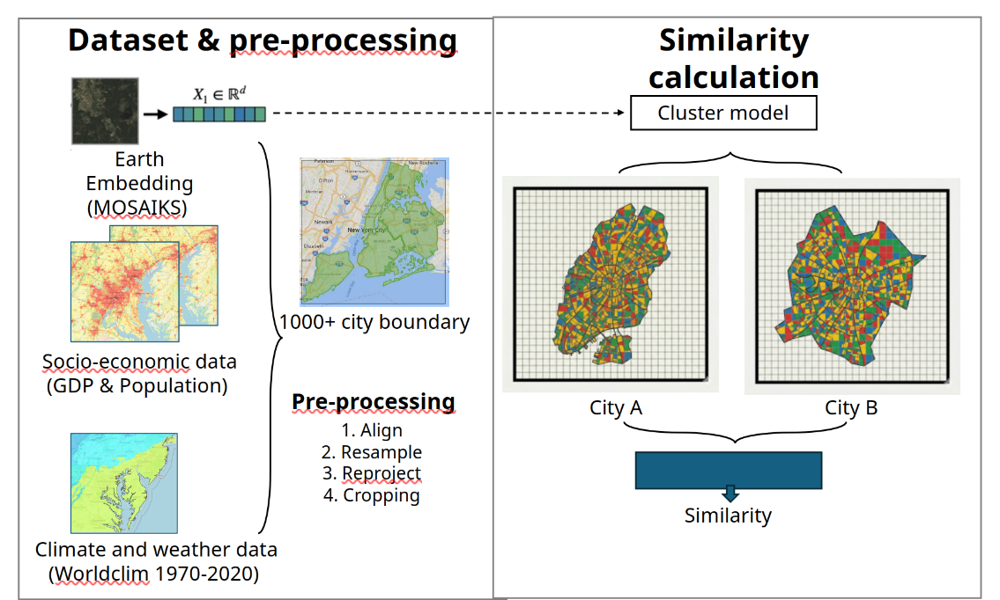

!!! tip "How to use this page during the Summit"
    - This page is your team’s shared workspace and final report-out page. It captures your group’s process and thinking throughout the Summit and will be used to share your work with others. 
    
    - Use this page as your team’s working record during the Summit and your final report-out.
    
    - The Summit has several different goals and thus you will use the page differently each day: Day 1 is for alignment, Day 2 is for building one useful thing, and Day 3 is for synthesis and report- out.
    
    - Look for the green buttons to indicate what you need to edit. 
    
    - Megaphones 📣 indicate which items you will be presenting during the end-of-day report-outs.

    - Only the items with megaphones will be visible when you hit the 'Summit Report Out' button. 

    - If you turn off 'Instructions' then you will only see the page content for public display.
    

# Echoes of the Earth: Mapping Landscape Analogues similarities and divergences to socioeconomic and climate data

!!! tip "For ESIIL staff"
    Group Number: 12
    
    Breakout Room #: S372B

    [ESIIL staff edit in Markdown](https://github.com/CU-ESIIL/Summit_group_2026_12/edit/main/docs/index.md?plain=1#L28){ .md-button target="_blank" rel="noopener" }
    

## People { #people .oasis-report-out-context }

| Name | Affiliation | Contact | Github |
|---|---|---|---|
|Zhuohong Li |Duke University |zhuohong.li@duke.edu | |
|Rocky Talchabhadel | | | |
|Theodore Harstook | University of Nevada, Reno | thartsook@unr.edu | theohartsook |
|Chris Turner | Aleut Community of St. Paul Island Tribal Government | cturner@aleut.com | iamchrisser |
|Jian Yang | | | |
|[Hari Sundar](https://github.com/CU-ESIIL/Innovation-Summit-2026/blob/main/docs/learners/hari-sundar.md)| National Lab of the Rockies| sriharisundar95@gmail.com | sriharisundar |
|Amelie Davis | |davis dot amelie at gmail | AmsPurdue |
|Isaac Buabeng | University of Vermont, Burlington | isaac.buabeng@uvm.edu | ikb001 |

## Team Norms and Decision Making { #team-norms-and-decision-making }

!!! note "Day 1 task"

    Suggested Self-Facilitation Instructions:
    
    - Round Robin: Everyone shares 1 norm that they think will be important for their team during the Summit and perhaps following the Summit (2 min).

    - After everyone has shared, make a list with as many norms as possible in GitHub (5–7 min).

    - Vote on your top 3 ideas. (Each person gets 3 votes; you can use all your votes on 1 idea or spread them out) (2 min).

    - In GitHub, move all team norms with votes to the top of the list.

    | Gradients of agreement | 
    |---|
    |  | 

    [Edit Team Norms in Markdown](https://github.com/CU-ESIIL/Summit_group_2026_12/edit/main/docs/index.md?plain=1#L87){ .md-button target="_blank" rel="noopener" }

Our team norms:

- Our group will use LLM derived generative-AI tools freely for code generation and debugging, and for editing our original text.
- Our group will not use AI tools for writing new text.
- Be kind.
- Don't interrupt. 
- We will always use area-preserving map projections!

Our decision making strategy:

We'll support good ideas with a thumbs up. Thumbs down from two group members is enough to veto an idea or approach. 

## Our product(s) 📣 { #product-direction .oasis-report-out-section .oasis-report-out-day2 }

!!! note "Day 2 Tasks"
    Morning Focus: questions, hypotheses, context; add at least one visual (photo of whiteboard/notes)

    Afternoon Focus: try a few datasets and analyses. Keep it visual, keep it simple. Update the site to reflect what you test. 

    [Edit content below here in Markdown](https://github.com/CU-ESIIL/Summit_group_2026_12/edit/main/docs/index.md?plain=1#L106){ .md-button target="_blank" rel="noopener" }

Short term:

...

Long term:

- ...
- ...

*Morning whiteboard or notes showing the question, hypotheses, and context we used to start Day 2.*

## Our question(s) 📣 { #project-question .oasis-report-out-section .oasis-report-out-day2 }

Our working questions:
1) Can the similaries and divergences in the land cover signature from Earth Embeddings be explained by socio-economic and climate data? 
2) How do cities accross the globe echo each other's urban signature and where do they vary the most (both within and between cities)? 
3) Is proximity a good indicator of similarity or are ecoregions, climate, socioeconomic data more important?

What would count as progress:

Complete our workflow for a subset of the world's largest global cities as proof of concept. 

## Hypotheses/Intentions [Optional: probably not relevant if you are creating an educational tool]

There a cities on 

## Why this matters (the “upshot”) 📣 { #why-this-matters .oasis-report-out-section .oasis-report-out-day2 }

This matters because it might help find sister cities and learn from their mistakes and successes in how they deal with urban development (urbanization) issues, economic development, congestion?, greenspace allotment (several small, "one" large), etc.

People who could use this:

- urban planners,
- city managers,
- other researchers needing those aggregated data

## Data sources we’re exploring 📣 { #data-exploration .oasis-report-out-section .oasis-report-out-day2 }

!!! note "data exploration"
    Provide a snapshot showing some initial data patterns. 

- City boundaries from [https://www.nature.com/articles/s41597-024-03746-7](https://figshare.com/projects/Greenspace_Seasonality_Data_Cube/190971)
- [MOSAIKs data](https://sdss.redivis.com/datasets/8bqm-8efrp0kqg/tables)
- [Climate data from WorldClim](https://www.worldclim.org/data/worldclim21.html#google_vignette)
- [Global population data from Oak Ridge National Lab](https://www.eastview.com/resources/e-collections/landscan/)
- [GDP data from ORNL] (https://www.earthdata.nasa.gov/data/catalog/ornl-cloud-gdp-xdeg-974-1)
- MAYBE (if GDP or pop data don't cooperate for some reason): [Night-time light as a proxy for GDP and electricity use](https://doi.org/10.1038/s41597-022-01322-5)

Local copies of our project data are stored in the [Cyverse Data Store](https://de.cyverse.org/data/ds/iplant/home/shared/esiil/Innovation_Summit_2026/Group_12)

## Methods/technologies we’re testing 📣 { #methods-and-code .oasis-report-out-section .oasis-report-out-day2 }

!!! note "methods"
    Add 2-4 methods/technologies we're testing (stats, models, viz).
    
    Workflow so far:
    - Select X cities based on Y.
    - Download Earth Embedding (EE), climate and SES data for select cities. 
    - Check coordinate systems for all data. Project if needed.
    - Extract EE, climate and SES data for select cities. 
    - Cluster EE features extracted for our cities.
    - Conduct independent ordination on the EE clusters and map the environmental variables (Climate and SES) to it.
    - Color points in ordination space based on ecoregion or continent or country.
    - Size points in ordination space based on actual distance to the most similar tile that is NOT within its city's boundary.

### Visuals

[View shared code](https://github.com/CU-ESIIL/Summit_group_2026_12/tree/main/code){ .md-button }

Methods/technologies we are testing:

| Method or technology | What we tested | Early note |
|---|---|---|
| ... | ... | ... |

### Challenges identified

- ...

### Next Steps

Short term: 

Long term: 

!!! note "Day 3 Tasks"
    Sythesis: highlight 2-3 visuals that tell the story; keep text crisp. Practice a 6-minute walkthrough of the homepage. Why -> Questions -> Data/Methods -> Findings -> Next 

    [Edit content below here in Markdown](https://github.com/CU-ESIIL/Summit_group_2026_12/edit/main/docs/index.md?plain=1#L203){ .md-button target="_blank" rel="noopener" }

## Team Photo, Again! { #team-photo }

*Team members and collaborators who contributed to this project.*

## Findings at a glance 📣 { #findings-at-a-glance .oasis-report-out-section .oasis-report-out-day3 }

Headline 1 — what, where, how much

...

Headline 2 — change/trend/contrast

...

Headline 3 — implication for practice or policy

...

## Visuals that tell a story 📣 { #story-visuals .oasis-report-out-section .oasis-report-out-day3 }

Coming soon.

## What’s next? 📣 { #whats-next .oasis-report-out-section .oasis-report-out-day3 }

Short term:

- ...

Long term:

- ...

Who should see this next

- ...

## Cite & Reuse { #cite-reuse }

If you use these materials, please cite:

Summit Team. (2026). *Summit Group 2026 Team 12 — Innovation Summit 2026*. https://github.com/CU-ESIIL/Summit_group_2026_12

License: CC-BY-4.0 unless noted. 
