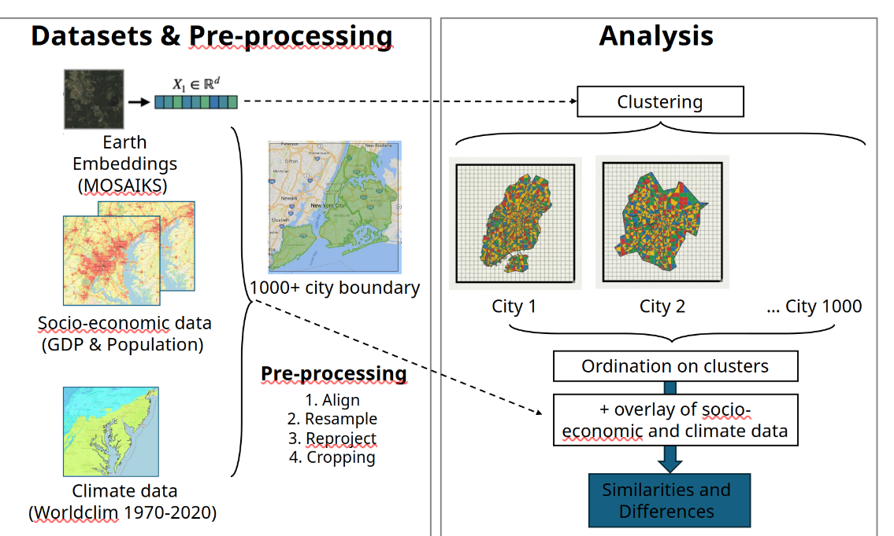
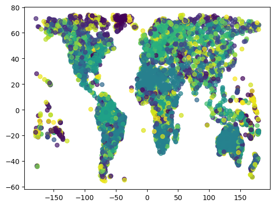
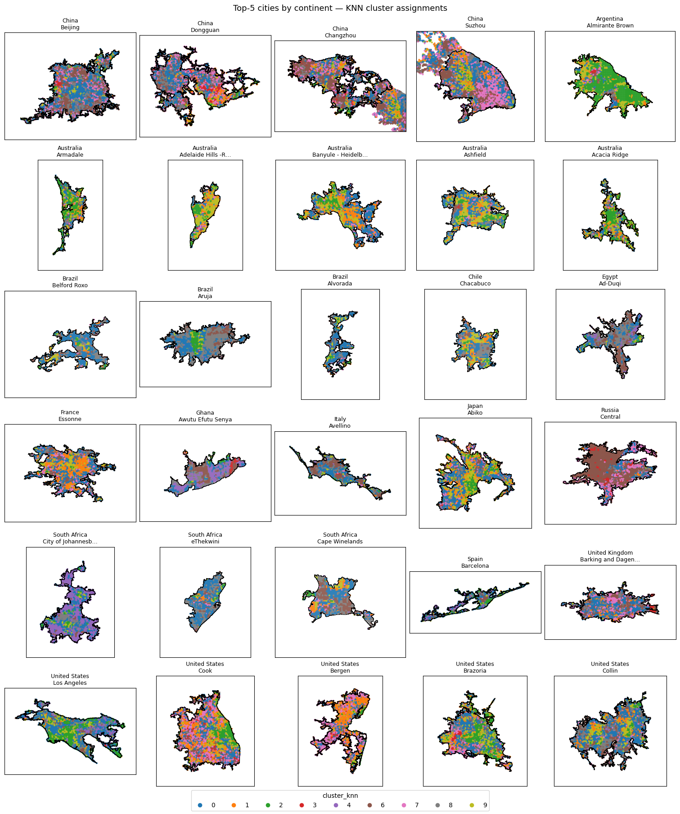
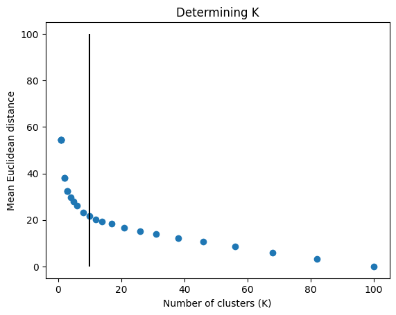
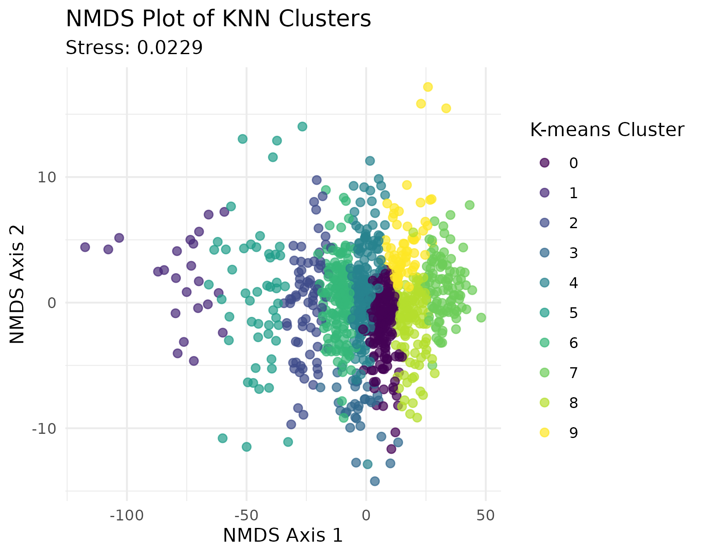

# Echoes of the Earth: Mapping Landscape Analogues to socioeconomic and climate data

!!! tip "For ESIIL staff"
    Group Number: 12
    
    Breakout Room #: S372B

    [ESIIL staff edit in Markdown](https://github.com/CU-ESIIL/Summit_group_2026_12/edit/main/docs/index.md?plain=1#L28){ .md-button target="_blank" rel="noopener" }
    

## People { #people .oasis-report-out-context }

| Name | Affiliation | Contact | Github |
|---|---|---|---|
|Zhuohong Li |Duke University |zhuohong.li@duke.edu | |
|Rocky Talchabhadel | Jackson State University | | |
|Theodore Harstook | University of Nevada, Reno | thartsook@unr.edu | theohartsook |
|Chris Turner | Aleut Community of St. Paul Island Tribal Government | cturner@aleut.com | iamchrisser |
|Jian Yang | University of Kentucky | jian.yang@uky.edu | |
|[Hari Sundar](https://github.com/CU-ESIIL/Innovation-Summit-2026/blob/main/docs/learners/hari-sundar.md)| National Lab of the Rockies| sriharisundar95@gmail.com | sriharisundar |
|Amelie Davis | |davis dot amelie at gmail | AmsPurdue |
|Isaac Buabeng | University of Vermont, Burlington | isaac.buabeng@uvm.edu | ikb001 |

## Team Norms and Decision Making { #team-norms-and-decision-making }

Our team norms:

- Our group will use LLM derived generative-AI tools freely for code generation and debugging, and for editing our original text.
- Our group will not use AI tools for writing new text.
- Be kind.
- Don't interrupt. 
- We will always use area-preserving map projections!

Our decision making strategy:

We'll support good ideas with a thumbs up. Thumbs down from two group members is enough to veto an idea or approach. 

## Our question(s) { #project-question .oasis-report-out-section .oasis-report-out-day2 }

Our working questions:

1. Can the similaries and divergences in the land cover signature from Earth Embeddings be explained by socio-economic and climate data? 
2. How do cities accross the globe echo each other's urban signature and where do they vary the most (both within and between cities)? 
3. Is proximity a good indicator of similarity or are ecoregions, climate, socioeconomic data more important?

What would count as progress:

    Complete our workflow for a subset of the world's largest global cities as proof of concept. 

## Hypotheses/Intentions 

TBD

## Why this matters (the “upshot”) { #why-this-matters .oasis-report-out-section .oasis-report-out-day2 }

This matters because it might help find sister cities and learn from their mistakes and successes in how they deal with urban development (urbanization) issues, economic development, congestion?, greenspace allotment (several small, "one" large), etc.

People who could use this:

- urban planners,
- city managers,
- other researchers needing those aggregated data

## Data sources we’re exploring  { #data-exploration .oasis-report-out-section .oasis-report-out-day2 }

- City boundaries from:

    >Wu, S., Song, Y., An, J. et al. High-resolution greenspace dynamic data cube from Sentinel-2 satellites over 1028 global major cities. Sci Data 11, 909 (2024). https://doi.org/10.1038/s41597-024-03746-7
    
- [MOSAIKs data](https://sdss.redivis.com/datasets/8bqm-8efrp0kqg/tables)
- [Climate data from WorldClim](https://www.worldclim.org/data/worldclim21.html#google_vignette)
- [Global population data from Oak Ridge National Lab](https://landscan.ornl.gov/)
- [GDP data from ORNL] (https://www.earthdata.nasa.gov/data/catalog/ornl-cloud-gdp-xdeg-974-1)
- MAYBE (if GDP or pop data don't cooperate for some reason): [Night-time light as a proxy for GDP and electricity use](https://doi.org/10.1038/s41597-022-01322-5)

Local copies of our project data are stored in the [Cyverse Data Store](https://de.cyverse.org/data/ds/iplant/home/shared/esiil/Innovation_Summit_2026/Group_12)

## Methods/technologies we’re testing { #methods-and-code .oasis-report-out-section .oasis-report-out-day2 }
    
Workflow so far:

- Select 30 cities based on 1028 of the world's global cities with data from the Scientific Data article.
- Download Earth Embedding (EE), climate and SES data for select cities. 
- Check coordinate systems for all data. Project if needed.
- Extract EE, climate and SES data for select cities. 
- Cluster EE features extracted for our cities.
- Conduct independent ordination on the EE clusters and map the environmental variables (Climate and SES) to it.
- Color points in ordination space based on ecoregion or continent or country or Global N/S.
- Size points in ordination space based on actual distance to the most similar tile that is NOT within its city's boundary.

### Visuals
#### Brainstorming!

#### Cosine Clustering

#### KNN Clustering

[View shared code](https://github.com/CU-ESIIL/Summit_group_2026_12/tree/main/code){ .md-button }

Methods/technologies we are testing:

| Method or technology | What we tested | Early note |
|---|---|---|
| Cosine clustering | cluster 1028 cities | ... |
| KNN Clustering | cluster 5 largest cities from each continent, K = 10 | K = 10 is good. Explanation TBD |
| ... | ... | ... | ... |

### Challenges identified

- Data volumes
- Different workflows/preferred tools (Python vs R)
- Cyberinfrastructure learning curve

### Next Steps

Short term: 

1. Finish socio-economic correlation with embeddings
2. Examine correlation with climate variables

Long term: 

1. Include more cities in sample
2. Consider including topographic data in analysis
3. Craft the story that illustrates the value of Earth embedding data to understand spatial signatures.

!!! note "Day 3 Tasks"
    Sythesis: highlight 2-3 visuals that tell the story; keep text crisp. Practice a 6-minute walkthrough of the homepage. Why -> Questions -> Data/Methods -> Findings -> Next 

## Team Photo, Again! { #team-photo }

*Team members and collaborators who contributed to this project.*

## Findings at a glance { #findings-at-a-glance .oasis-report-out-section .oasis-report-out-day3 }

 - 10 clusters appears to be sufficient for KNN clustering for our subset of cities (n = 30)

 - KNN clustering approach appears to be validated using ordination
.png)

## Visuals that tell a story { #story-visuals .oasis-report-out-section .oasis-report-out-day3 }

<iframe src="assets/figures/clusters_map.html" width="100%" height="560" style="border:0;"></iframe>

<iframe src="assets/images/Chicago_leaflet.html" width="100%" height="560" style="border:0;"></iframe>

## What’s next? { #whats-next .oasis-report-out-section .oasis-report-out-day3 }

Short term:

- Celebrate our luck at having such a great team!
- Finish correlations with socio-economic data
- Investigate correlations with climate and topographic data
- Develop formal research question

Long term:

- Repeat analysis using larger sample (~1000 cities)
- Write a paper about our work
- Use Earth embeddings in our daily work.

## Cite & Reuse { #cite-reuse }

If you use these materials, please cite:

Summit Team. (2026). *Summit Group 2026 Team 12 — Innovation Summit 2026*. https://github.com/CU-ESIIL/Summit_group_2026_12

License: CC-BY-4.0 unless noted. 
